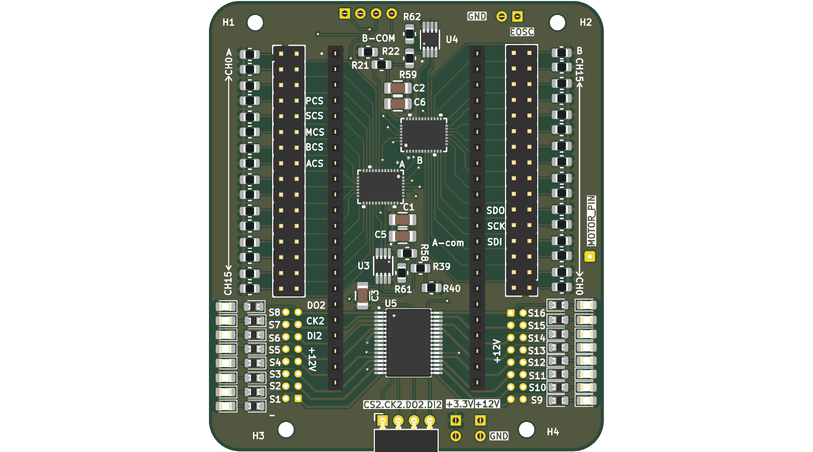
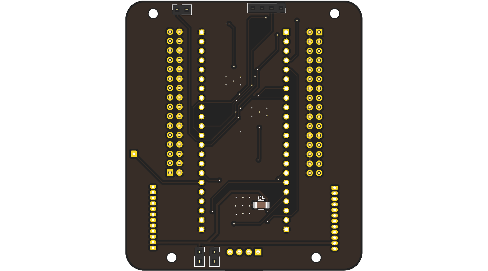
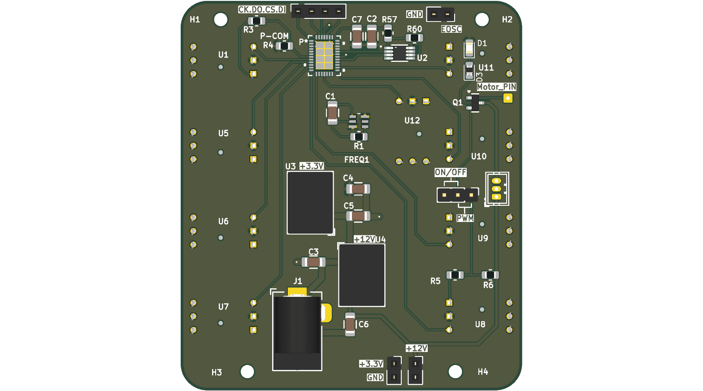
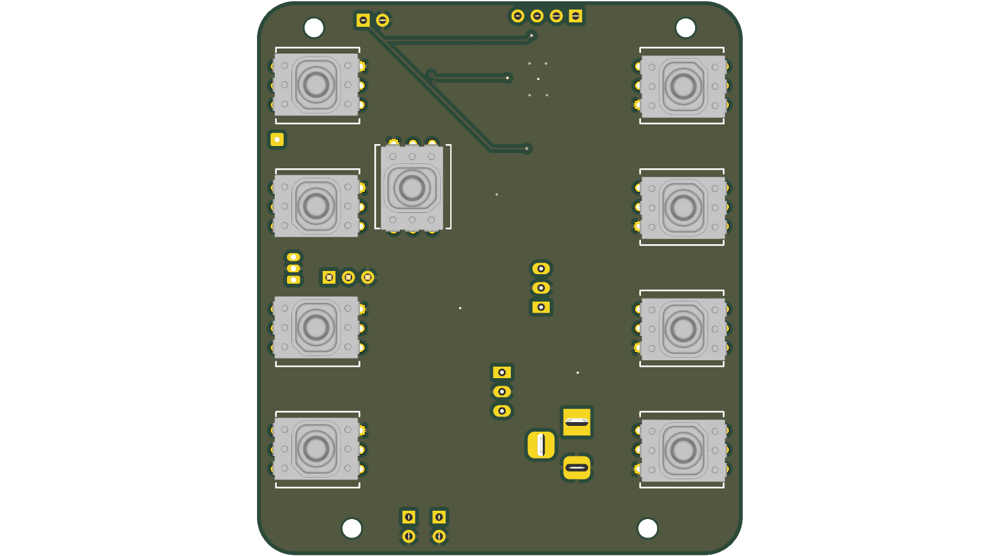

# _Peumatic Backpack_
This is a Penumatic System that senses and actuates the multiple soft actuators while communicating with the remote pc 

## _Hardware_ 
To control and sense the robotic actuator system, developed using KiCad 8, this repository will build the Gerber files of the system upon pushing the action artifacts specific to JLCPCB 

### Components
ESP-32 S3 Micro Controller
LTC2498 24-bit ADC to sense the actuator position
LTC6906 external oscillator for ADC
MCZ33996 for actuating the solenoidal valves

## _Firmware_ 
Developed in C using FreeRTOS for increased concurrency. Code is developed using VSCode ESP-IDF extension

### Images

  
  

  
  

rendered with [kicad-render](https://github.com/linalinn/kicad-render)
